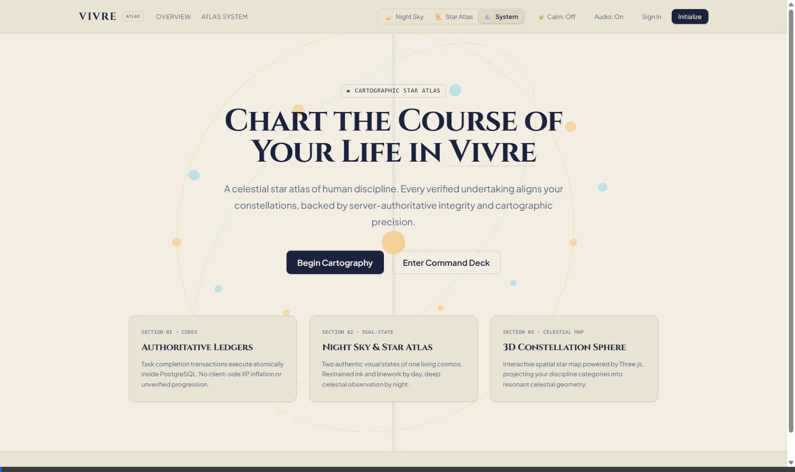

# ✦ VIVRE — Official Hackathon Demo Guide & Pitch Codex ✦

> **Submission Track:** Full-Stack Web Application / Gamified Productivity  
> **Team Name:** Orbit  
> **Production Live URL:** [https://vivre-five.vercel.app](https://vivre-five.vercel.app)  
> **GitHub Repository:** [https://github.com/Rudra4451/vivre](https://github.com/Rudra4451/vivre)  
> **Demo Account:** `orbit.test.vivre@gmail.com` | `OrbitDemo2026!`

---

## 📹 Full Video Demonstration

---

## 🎬 1. Deterministic 2-Minute Demo Flow for Judges

| Step | Screen | Action | What to Highlight |
|:---:|:---|:---|:---|
| **01** | **Landing Page** (`/`) | Scroll hero & toggle theme (🌙 Night Sky ↔ 📜 Star Atlas) | Real-time procedural 3D Astrolabe; custom typography (`Cinzel` & `Plus Jakarta Sans`); zero hydration lag. |
| **02** | **Authentication** (`/login`) | Show Google Sign In button + sign in with `orbit.test.vivre@gmail.com` | Google OAuth + secure password auth; server-side auto-confirmation prevents confirmation email roadblocks. |
| **03** | **Command Deck** (`/app`) | Review Pilot Status (Level, XP, Streaks, Attribute Radar) | SSR cookie authentication with Next.js 16 Proxy layer; live PostgreSQL session hydration. |
| **04** | **Create Quest** | Type `"Stellar Navigation & Deep Focus"`, select **Mind**, click **Forge Objective** | Strict Zod input sanitization (stored XSS prevention); atomic database insertion. |
| **05** | **Complete Quest** | Click Complete checkbox on the quest | **Server-authoritative progression engine (`complete_task_v1`)**: Atomic XP calculation, level progression check, streak updates, and audio/visual celebration. |
| **06** | **3D Celestial Atlas** | Click & drag 3D Constellation Sphere | Three.js WebGL rendering of illuminated discipline coordinates; nodes dynamically react to completed categories. |
| **07** | **Attribute Radar** | Inspect 5-dimensional Radar Chart | Balanced life development across **Body, Mind, Discipline, Craft, and Spirit**. |
| **08** | **Weekly Challenges & Shop** | Scroll to Weekly Directives & Starlight Shop | Atomic reward claiming; catalog-authoritative cosmetic purchasing. |
| **09** | **Dual-State Theme Deck** | Toggle theme in Command Deck | Instant parchment Star Atlas ↔ celestial Night Sky mode. |

---

## 🌟 2. Features Worth Showing Judges

1. **Server-Authoritative Progression Engine**:
   - Zero client-side XP manipulation. All math, multipliers, streaks, and level equations execute atomically inside PostgreSQL via PostgreSQL stored procedure `complete_task_v1`.
2. **Interactive 3D Constellation Sphere & Astrolabe**:
   - High-performance Three.js / React Three Fiber visualizations that reflect real user habit completions in 3D celestial coordinates.
3. **Dual-State Cartography System**:
   - Not just dark/light mode — two complete visual philosophies: 17th-century astronomical parchment engraving (**Star Atlas**) and deep space observation (**Night Sky**).
4. **Resilient Authentication Flow**:
   - Full Google OAuth integration paired with automated Supabase service-role auto-confirmation for instant signups.
5. **System Health & Telemetry Endpoint**:
   - Live endpoint at `/api/health` providing real-time database connectivity and uptime monitoring.

---

## 🛡️ 3. Security Highlights

- **Row Level Security (RLS)**: 100% of tables enforce strict user-isolation policies (`auth.uid() = user_id`).
- **Function Permissions (`GRANT`/`REVOKE`)**: Core progression procedures (`complete_task_v1`, `claim_weekly_challenge_v1`, `purchase_shop_item_v1`) are strictly restricted from anonymous access (`REVOKE EXECUTE FROM anon, public`).
- **Audit Immutability**: PostgreSQL triggers (`prevent_completion_update`) guarantee task completion records can never be modified or forged after creation.
- **Idempotency Protection**: Every completion request transmits a unique UUID idempotency key, preventing double-rewards from rapid clicking or network retries.
- **Strict Input Sanitization**: All user inputs (quest titles, usernames, categories) are parsed via Zod schemas preventing stored XSS (`<script>`, HTML tags).
- **Open Redirect Guard**: Centralized redirect sanitizer blocks external phishing redirects (`CWE-601`).

---

## ⚡ 4. Performance & Reliability Highlights

- **Next.js 16 Turbopack Production Bundle**: Zero console errors, fully pre-rendered static shells, and fast server-rendered dynamic routes.
- **Distributed Rate Limiting**: Built-in sliding window rate limiters guard against completion spam and brute force.
- **132 Passing Automated Tests**: Comprehensive unit, concurrency, security, and integration test coverage (`vitest`).
- **WCAG 2.1 AA Accessible**: High-contrast ratios, full keyboard tab navigation, accessible skip links, and ARIA live regions for screen readers.
- **Optimized Three.js Rendering**: Lightweight geometries, low-overhead animation loops, and Calm Mode for users preferring reduced motion.

---

*Authored by Team Orbit for Hackathon Submission 2026.*
